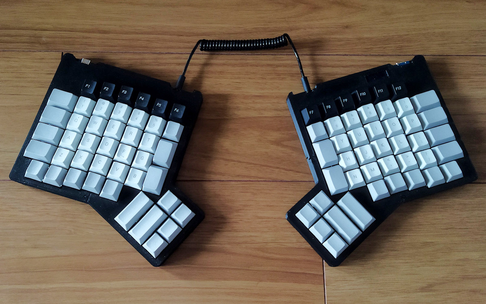
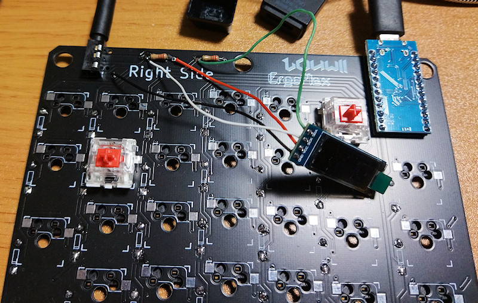

(日本語による解説は[ＴＮＫソフトウェア](https://www.tnksoft.com/soft/iot/ergomax/)のサイトにて公開しています)

# Ergomax TNK Remix
Customized QMK Firmware and case for ErgoMax keyboard.

## :question: What's this?
[ErgoMax](https://github.com/LouWii/ErgoMax) is an ergonomic keyboard designed and developed by LowWii. I 'm providing optimized cases and firmware for ErgoMaxReversible PCB.

You are free to modify and redistribute the cases and programs. It is not required, but I would be happy to see a reference to this project page.

## :memo: Technical note

Electronic boards and components can be mounted in the same way as the [original](https://github.com/LouWii/ErgoMax/blob/master/Guide/ASSEMBLY.md).

If you wish to mount an OLED, wire it manually as shown in this picture.

Dedicated cases are included in the "case" folder. These models are designed for output on an additive manufacturing 3D printer, so there is more margin for the size of the keyswitch holes, etc.

A built firmware is including in "build" folder. Write this hex file by [QML Toolbox](https://qmk.fm/toolbox/) and you can use all the features without any programming.

"tool" folder contains the tools for Helix Remix. Those tools requires Python3 develop environment.
- **hex2bmp.py** : Convert unscii hex data to bitmap image.
- **bmp2code.py** : Convert 8x16 font bitmap to c code as glcdfont.

"client" folder contains a library and sample program for displaying unicode characters and bitmap images via serial communication between a PC and thi keyboard in the C# language.

If you get an error about HidLibrary when compiling the library, please install the library of the same name from Nuget.

## :yen: Donate, please!

## :copyright: License
[GPLv3](https://www.gnu.org/licenses/gpl-3.0.html)